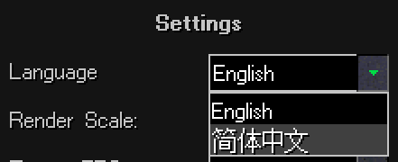
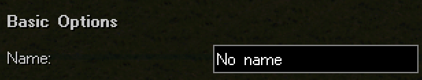

This guide details how to translate the World-Altering Editor to new languages, using Chinese as an example.

## 1) Create translation folder

Check out the `/Config/Translations` folder. The one visible in your screenshot.

There, make a copy of the `en` folder. Name the new folder with the country code of your desired language, for example `cn` for Chinese.

Inside your new folder, rename `Translation_en.ini` to match the folder name, for example `Translation_cn.ini`. Do the same for `ObjectNames_en.ini`.

## 2) Add translation definition

Open `/Config/Translations.ini`.

There, add your new language under the `[Translations]` section, like follows:

```ini
[Translations]
0=English
1=Chinese
```

Then, add a new INI section for your new language to the file. Again, using Chinese as an example

```ini
[Chinese]
UIName=简体中文
Directory=cn
```

If you did everything correctly, your new language should now be available in the main menu.



Afterwards, you can simply open the string-table INI file in your translation's folder, in this example `Translation_cn.ini`, and get to translating the UI strings.

If you want to translate object names, you can define them in `ObjectNames_*.ini`, in this example `ObjectNames_cn.ini`.

This is all that is needed to get a basic translation working. The following sections are optional, and a more advanced topic.

## 3) (Optional) Editing UI for a language

Sometimes, a translation might require UI changes. For example, some UI elements might need to be wider to accommodate longer text strings.

Starting from version 1.7.10, WAE supports modifying UI through overriding INI files added into the translation's directory.

For example, when WAE reads `BasicSectionConfigWindow.ini` for the Edit -> Basic user interface, WAE reads it from the following paths inside (`Config`) folder:

1) `/UI/Windows/` 
2) `/Default/UI/Windows/` if not found in the first path.

When `BasicSectionConfigWindow.ini` has been found from one of those locations, WAE then checks whether the current language has an override for it. In this file's example, WAE would read `/Translations/cn/UI/Windows/BasicSectionConfigWindow.ini`. If found, this file is merged into the original file's contents, with the translation-specific file taking priority in case of conflicting files.

For example, if `/Default/UI/Windows/BasicSectionConfigWindow.ini` has the following code:

```ini
[lblHeader]
FontIndex=1
$Text=translate(Basic Options)
$X=horizontalCenterOnParent()
$Y=EMPTY_SPACE_TOP
```

And if, for some reason, we wanted to change the header's position in our translation to the left edge of the window, we could create the file `/Translations/cn/UI/Windows/BasicSectionConfigWindow.ini`, and inside add the following code:

```ini
[lblHeader]
$X=EMPTY_SPACE_SIDES
```



Control positions can be changed, windows resized etc. using this method.

## 4) (Optional) Overriding textures

There should rarely, if ever, be a need for this, but if your language requires modifying UI textures, that is also possible.

Similarly to the UI INI files above, when WAE loads a texture, it first looks it up whether the active translation's directory contains that texture.

For example, when loading `Content/checkBoxChecked.png`, with our example Chinese as the active language, WAE checks whether `/Config/Translations/cn/checkBoxChecked.png` exists, and if so, that is loaded instead of the file in the `Config` folder.